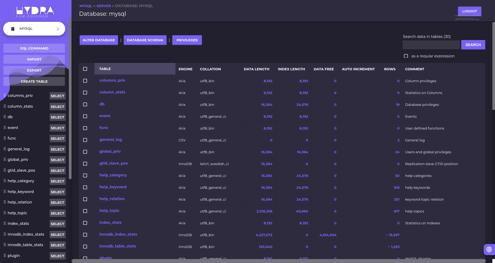

# Hydra - Material Design Dark Theme for AdminerEvo
An AdminerEvo dark mode material design theme based on inspired by the Adminer material design. [AdminerEvo](https://adminerevo.org/) is the successor of [Adminer](https://www.adminer.org/) one of the best DB-Management tools out there. Install the theme with two little steps, just download the `adminer.css` file and put the file in the same folder as AdminerEvo's `index.php`.

## :zap: Usage
* Get a copy of [AdminerEvo](https://adminerevo.org/)
* Download the `adminer.css` from [here](https://raw.githubusercontent.com/CodeShakingSheep/Hydra-Dark-Theme-for-Adminer/master/adminer.css)
* Put them both in the same web folder

## :mag: Preview

## :page_with_curl: License
Hydra Dark Theme for AdminerEvo is licensed under the [MIT License](https://github.com/CodeShakingSheep/Hydra-Dark-Theme-for-Adminer/blob/master/LICENSE).

## :sun_with_face: Thanks to
* Hydra, Material Design Dark Theme for AdminerEvo is the successor of [Hydra for Adminer](https://github.com/Niyko/Hydra-Dark-Theme-for-Adminer) by Niyko
* Hydra, Material Design Dark Theme for Adminer is a clone made from [Adminer-Material-Theme](https://github.com/arcs-/Adminer-Material-Theme)

---